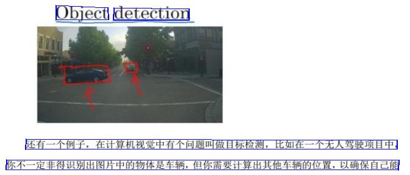
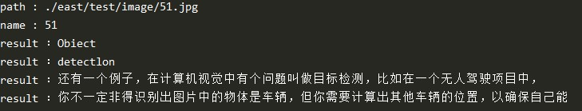
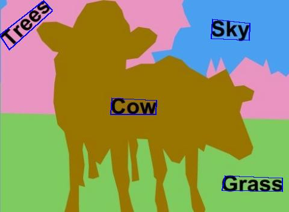
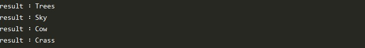
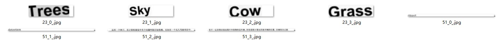

# ocr_chinese
Keras实现自然场景下图像文字检测和识别，EAST/CRNN/CTC.

代码都是使用Keras+后端TensorFlow实现，方便生产环境部署和维护；

- EAST模型实现文字检测，文字方向支持90° ~ -90°间任意角度，包含中字/英文/数字/符号等，目标检测的方式画框定位，返回文本框的四个坐标。
- CRNN模型实现不定长文字识别，输出使用CTC算法模块。
- TensorFlow自带CTC，算法原理可以参考我的博客[CTC算法在OCR文字识别上的应用]( https://felixbrave.github.io/2020/03/16/CTC/ )，还有[其他博文]( https://xiaodu.io/ctc-explained/ )


### 开发环境

```shell
python3.6 + tensorflow1.14.0 + keras2.1.6
# 或使用pip环境复制
pip install -r environment.txt
# GPU环境
NVIDIA Drivers/CUDA/cuDNN
```

###  How to use

从输入一张图片到端到端的检测及识别文字

```python
python predict.py
```

- 当检测比较正的文本，且是书面文字（不是艺术字），准确率比较高，主要确保EAST模型框选文本正确，不要框选不全，涉及模型训练和超参数调试，具体看Training部分；







- 当检测存在角度的文本，确定文本四个顶点的坐标，旋转及边缘延伸，确保输入CRNN模型时文字完整性；






可以看到输入CRNN时裁剪下来的文字图片；




EAST模型检测文本框

```
cd east
python predict.py
```

CRNN模型识别文字

```
cd crnn
python predict.py
```


### 代码结构

```shell
- crnn                    # 文字识别模型
|-- predict_crnn.py       # 预测文字，衔接east模型，裁剪及文字旋转
|-- data                  # 数据集预处理
|-- net                   # crnn网络实现及训练，char_std_5990.txt文字对应标签序
|-- model                 # 模型weights

- east                    # 文字检测模型
|-- predict_east.py       # 预测文字位置，画框 
|-- data                  # images数据集预处理
|-- net                   # east网络实现及训练，network/loss/training
|-- model                 # 模型weights

- predict.py              # 实现end-to-end预测，模型衔接
```

### Training
* EAST

  本项目数据集：[天池ICPR]( https://tianchi.aliyun.com/competition/entrance/231651/introduction ) MTWI 2018 挑战赛二网络图像的文本检测。淘宝上收集的商品图片，数据量充分，涵盖数十种字体，几个到几百像素字号，多种版式，较多干扰背景。（[百度云](https://pan.baidu.com/s/1S9WpyXZ_wVWbKo-WsB0q5A)/提取码：sxhh）

  其他数据集：[MSRA-TD500]( http://www.iapr-tc11.org/mediawiki/index.php?title=MSRA_Text_Detection_500_Database_(MSRA-TD500) ) 自然场景下的文本检测数据集。

* CRNN
  本项目数据集：通用中文语料库，通过截取文本和随机生成，字体经过了大小、灰度、模糊、透视等变化，共360万张图片，图像分辨率w*h为280x32，涵盖了汉字、标点、英文、数字共5990个字符。（[百度云](https://pan.baidu.com/s/1JbsP0wGGsCzn3MwEbUHzMA)/提取码：4m2q）

  其他数据集：

  ​	1、Synthetic Data for Text Localisation 在复杂背景下人工合成的自然场景文本数据。英文[GitHub](https://github.com/ankush-me/SynthText)，中文[GitHub](https://github.com/wang-tf/Chinese_OCR_synthetic_data)。

  ​	2、[A Large Chinese Text Dataset in the Wild]( https://ctwdataset.github.io/index.html ) 街景中文字符检测和识别的数据集，包括平面文本、凸起文本、光照不足的文本、远处文本、部分遮挡文本等。

  本项目使用的数据集针对的是书面文字，所以在识别书面和打印文字上效果较好，如果要识别艺术字或手写体需要增加相应训练集。

### Documents

Writing ......

### 参考

- [AdvancedEAST]( https://github.com/huoyijie/AdvancedEAST )
- [Pytorch_CRNN]( https://github.com/AstarLight/Lets_OCR/tree/master/recognizer/crnn )
- [CHINESE-OCR]( https://github.com/xiaofengShi/CHINESE-OCR )
